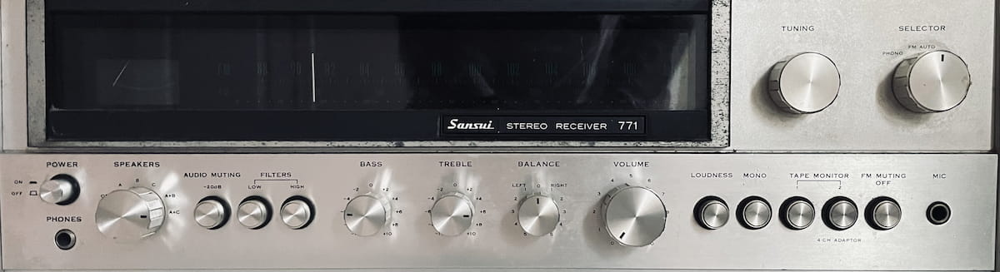

# Sui Sans

A vintage-inspired typeface born from 1970s hi-fi heritage.


*Original Sansui stereo controls that inspired this typeface*

## About

Sui Sans is a faithful digital recreation of the typography found on vintage Sansui stereo equipment from the 1970s. This font captures the distinctive character of an era when audio equipment was built to last and designed with both function and aesthetic appeal in mind.

The typeface originates from my father's beloved Sansui stereo system, whose clean, geometric letterforms embodied the precision and craftsmanship of Japanese industrial design during the golden age of hi-fi audio.


*Character samples and usage examples*

## Font Details

- **Font Name:** Sui Sans
- **Style:** Regular
- **Format:** OpenType Font (.otf)
- **File:** `Sui-Regular.otf`
- **Character Set:** Latin alphabet, numerals, and basic symbols
- **Design Period:** 1970s-inspired
- **Original Source:** Sansui stereo equipment typography

## Installation

### Desktop Installation
1. Download `Sui-Regular.otf`
2. Double-click the font file
3. Click "Install Font" (Windows) or the font will be added automatically (macOS)
4. The font will be available in your font menu as "Sui Sans"

### Web Usage
Convert the OTF file to web formats (WOFF/WOFF2) using tools like FontSquirrel's Webfont Generator, then include in your CSS:

```css
@font-face {
    font-family: 'Sui Sans';
    src: url('sui-sans-regular.woff2') format('woff2'),
         url('sui-sans-regular.woff') format('woff');
    font-weight: normal;
    font-style: normal;
}

body {
    font-family: 'Sui Sans', sans-serif;
}
```

## Design Characteristics

- **Geometric Sans-Serif:** Clean, precise letterforms with consistent stroke weights
- **Technical Aesthetic:** Inspired by industrial control panel typography
- **Vintage Character:** Captures the essence of 1970s Japanese design philosophy
- **High Legibility:** Optimized for both display and text applications
- **Nostalgic Appeal:** Perfect for retro-themed projects and vintage audio branding

## Use Cases

- Vintage audio equipment branding
- Retro-themed graphic design
- Music industry applications
- Editorial design for articles about vintage hi-fi
- Display typography for nostalgic projects
- Brand identity for audio-related businesses

## License

[Add your chosen license here - e.g., SIL Open Font License, Creative Commons, or custom license]

## Credits

**Designer:** Matt Whalley  
**Tool:** Figma  
**Inspiration:** Sansui stereo equipment typography, circa 1970s  
**Year:** 2025

## Version History

- **v1.0** - Initial release with complete Latin character set

---

*Sui Sans pays homage to the era when stereo systems were the centerpiece of the living room and typography was crafted with the same precision as the audio equipment it adorned.*
